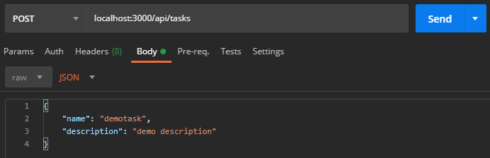
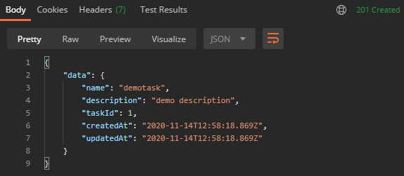
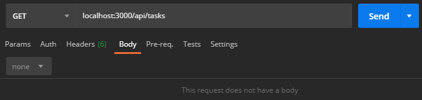
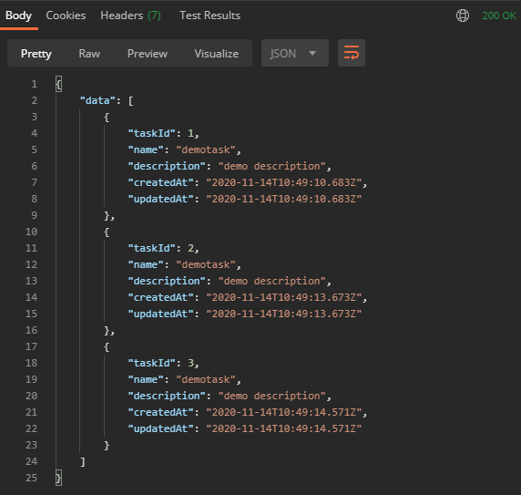
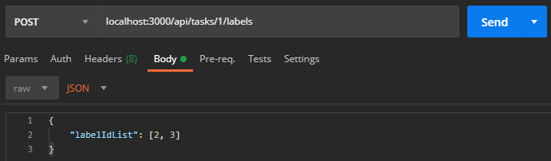
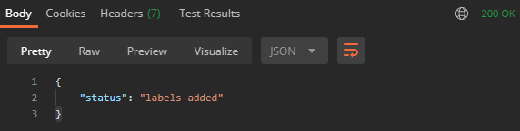
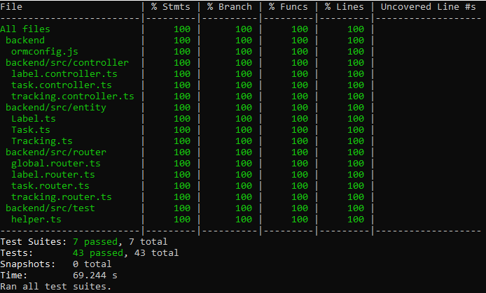
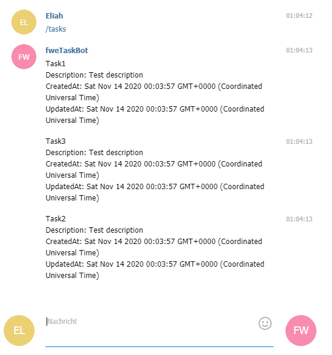

# Fortgeschrittene Webentwicklung - Homework 1
As part of the course 'Fortgeschrittene Webentwicklung' we had to create a timetracker application. In this first homework I developed a backend api for this application.

## General informations

* Backend can be reached on http://localhost:3000/api
* Database can be accessed with `docker-compose exec mariadb mariadb -uuser -ppassword data` 
* Database can be synchronised with `docker-compose exec backend npm run typeorm schema:sync`
* Fixtures can be inserted with `docker-compose exec backend npm run fixtures`

## Routes

## `/tasks`

| Route          | Method       | Body          | Description  |
| :------------- | :----------  | :-----------  | :----------- |
| `/`            |   GET        |  -   | returns all tasks |
| `/`            |   POST       |   { name: 'demotask',  description: 'demo description'}  | creates a new task |
| `/:taskId`     |   GET        |  -   | returns a specific task where taskId = `:taskId`|
| `/:taskId`     |   DELETE     |  -   | deletes specific task where taskId = `:taskId`|
| `/:taskId`     |   PATCH      |   { name: 'new name',  description: 'new description'}  | updates specific task where taskId = `:taskId` |
| `/:taskId/labels`     |   POST      |  { labelIdList: [1, 2, ...] }  | adds labels to task where taskId = `:taskId` |
| `/:taskId/labels`     |   DELETE      |  { labelIdList: [1, 2, ...] }  | deletes labels from task where taskId = `:taskId` |
| `/:taskId/labels`     |   GET      |  -  | returns all associated labels from task where taskId = `:taskId` |
| `/:taskId/trackings`     |   GET      |   -  | returns all associated trackings from task where taskId = `:taskId` |

## `/labels`

| Route          | Method       | Body          | Description  |
| :------------- | :----------  | :-----------  | :----------- |
| `/`            |   GET        |  -   | returns all labels |
| `/`            |   POST       |  { name: 'demolabel' }  | creates a new label |
| `/:labelId`     |   GET        |  -   | returns a specific label where labelId = `:labelId`|
| `/:labelId`     |   DELETE     |  -   | deletes a specific label where labelId = `:labelId`|
| `/:labelId`     |   PATCH      |  { name: 'demolabel' }   | updates a specific label where labelId = `:labelId` |
| `/:labelId/tasks`     |   POST      |    | returns all tasks from label where labelId = `:labelId` |

## `/trackings`

| Route          | Method       | Body          | Description  |
| :------------- | :----------  | :-----------  | :----------- |
| `/`            |   GET        |  -   | returns all trackings |
| `/`            |   POST       |  { description: 'demo description',  taskId: 1 } | creates a new tracking |
| `/:trackingId`     |   GET        |  -   | returns a specific tracking where trackingId = `:trackingId`|
| `/:trackingId`     |   DELETE     |  -   | deletes a specific tracking where trackingId = `:trackingId`|
| `/:trackingId`     |   PATCH      |  { description: 'new description', startTime: timestamp,  endTime: timestamp }   | updates a specific tracking where trackingId = `:trackingId` |

## Examples

### Creating a new task

### Getting all tasks

### Adding labels to task

## Testing

For automated testing I used the frameworks `jest` and `supertest`. To run the predefined tests, execute the following command on a command prompt in the root folder of the project: `docker-compose exec backend npm run test`. 
**Output should look like this:** 

Project can also be tested through programs like `postman`.

## Freestyle task

In the freestyle task I developed the possibility to get all tasks through a telegram bot which I created. For that I used an api called [node-telegram-bot-api](https://github.com/yagop/node-telegram-bot-api). First you have to load the fixtures, so that the bot can access the data from database. To get in touch with the bot you need to search in the telegram app for `fweTaskBot` or click the following link: [t.me/FWETASKbot](https://t.me/FWETASKbot). 
Now you can get your tasks by typing `/tasks` as a message to the bot. In the background the bot will obtain all tasks from the database and then it will send you each task in a seperate message.

### Example

## License
**The MIT License (MIT)**

Copyright © 2020 Eliah Vogel