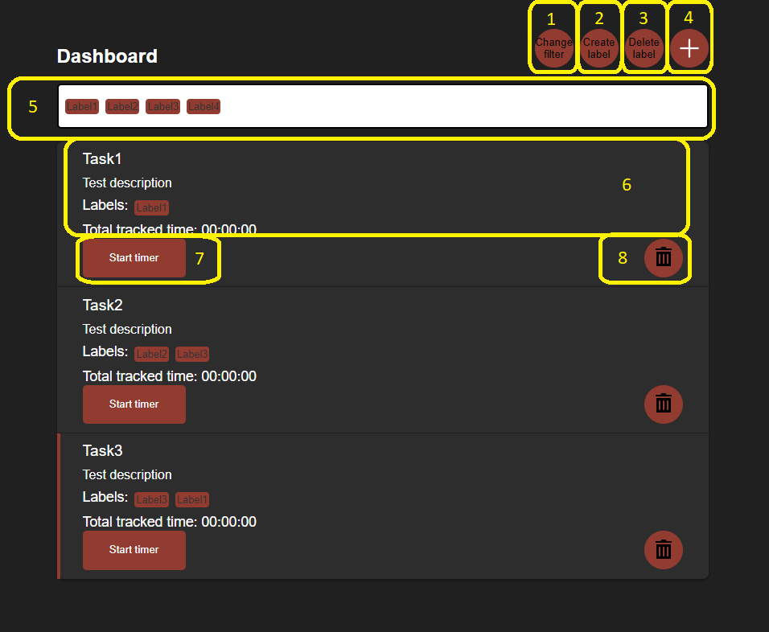
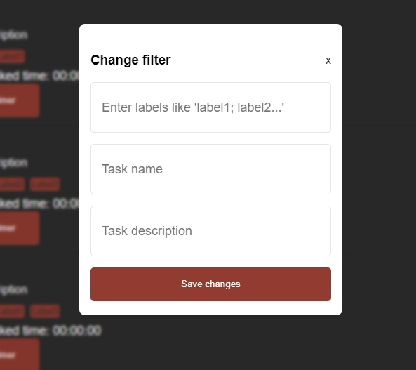
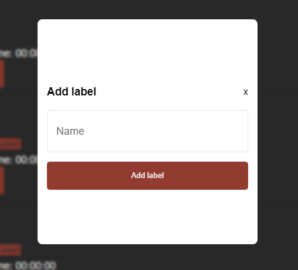
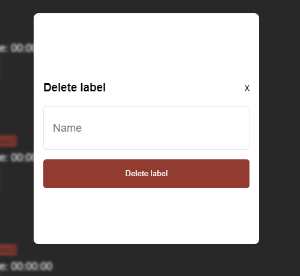
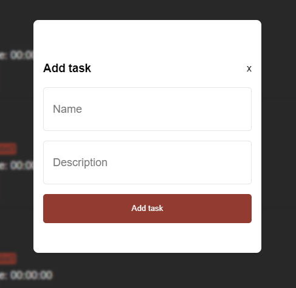
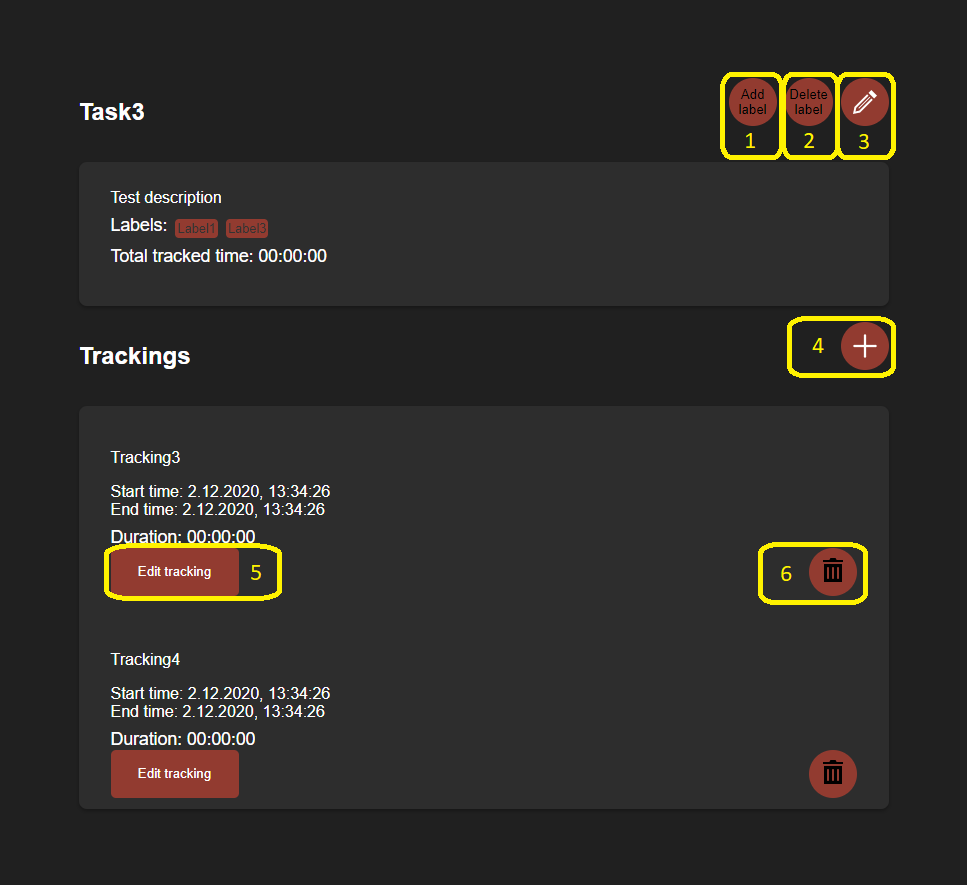
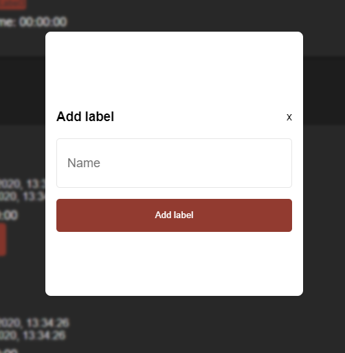
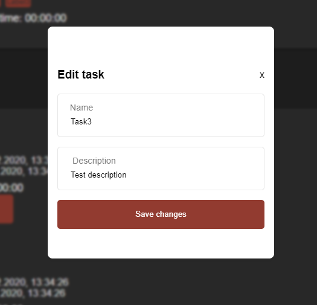
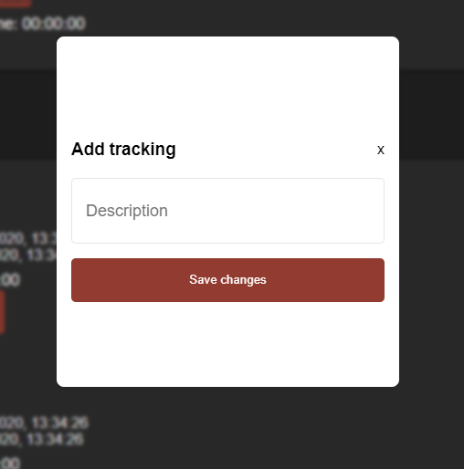
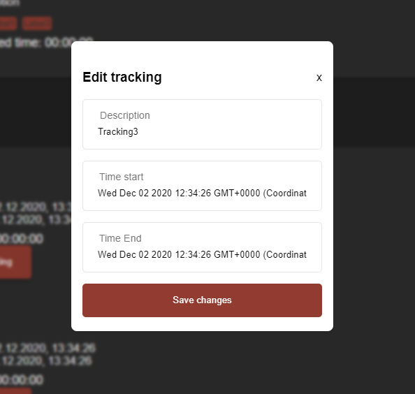

# Fortgeschrittene Webentwicklung - Homework 2
As part of the course 'Fortgeschrittene Webentwicklung' we had to create a timetracker application. In this first homework I developed a frontend page for this application.

## General informations

* Frontend can be reached on http://localhost:80

## Functionality

### Dashboard

1. Change filter

Click here to change the filter. The following modal will come up:
</img>

2. Create label filter

Click here to create a label. The following modal will come up:
</img>

1. Change filter

Click here to change the filter. The following modal will come up:
</img>

1. Change filter

Click here to change the filter. The following modal will come up:
</img>

1. Change filter

Click here to change the filter. The following modal will come up:
</img>

1. Change filter

Click here to change the filter. The following modal will come up:
</img>

1. Change filter

Click here to change the filter. The following modal will come up:
</img>

1. Change filter

Click here to change the filter. The following modal will come up:
</img>

2. Click here to create a label. The following modal will come up:

3. Click here to delete the filter. The following modal will come up:

4. Click here to create a task. The following modal will come up:

5. Here are all available labels listed.
6. Click here to visit the task detail site.
7. Click here to start a new tracking of a specific task.
8. Click here to delete a specific task

### Task detail site

1. Click here to add a label to the task. The following modal will come up:

2. Click here to delete a label from the task. The following modal will come up:

3. Click here to edit the task. The following modal will come up:

4. Click here to add a tracking to the task. The following modal will come up:

5. Click here to edit a tracking. The following modal will come up:

6. Click here to delete a tracking

## License
**The MIT License (MIT)**

Copyright © 2020 Eliah Vogel